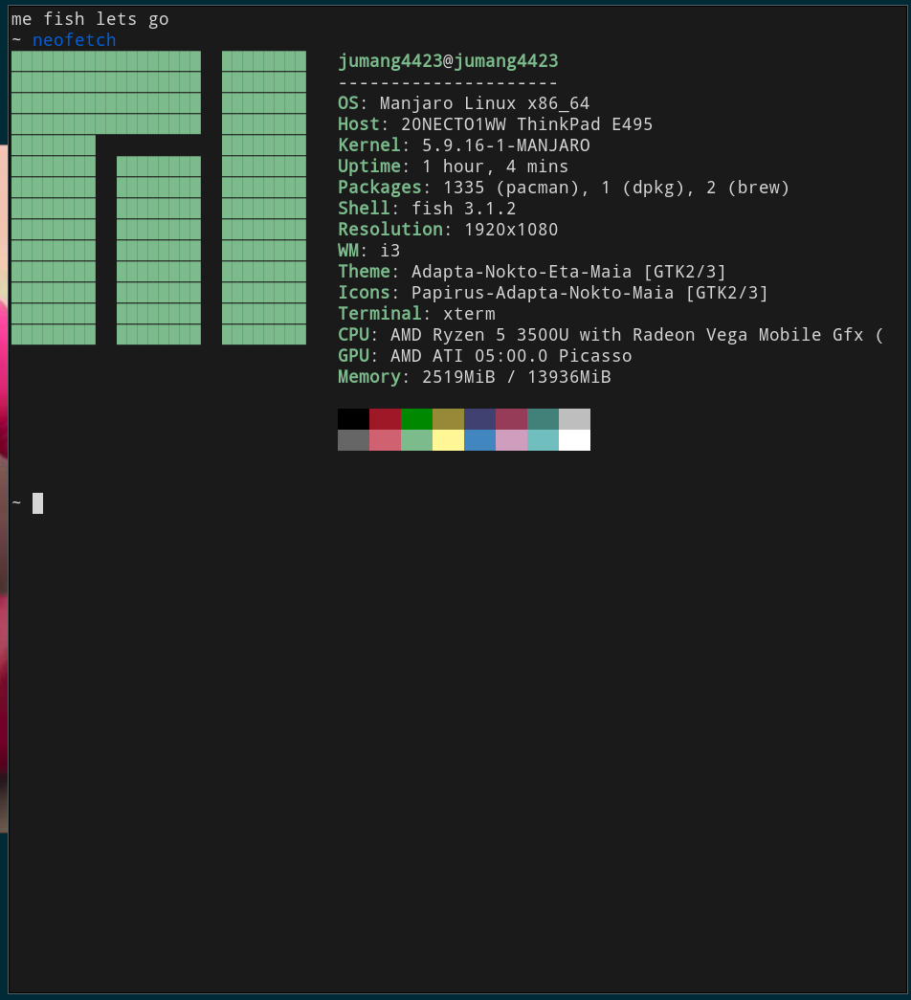

# CUIを使う意味

GUIはとても便利なシステムですが、欠点があります

* パソコンの**すべての機能を十分に使えない**
* マウスよりコマンドをうったほうが早い
* いらない情報が多い

これはパソコンを通常利用するライトユーザにはほぼ影響しませんが、開発者としてはGUIを使うのとCUIを使うのでは効率と視野が違います

CUIのメリットは

・正確で細かな操作が可能

 ・操作を自動化しやすい 

・手数が少なくてすむ

なので以降はCUIを使って、環境構築やソフト開発をしていきたいと思います

最初はコマンドが定着しないため、GUIよりも不便に感じることがあると思いますが、使っていくうちにその良さに気づくかと思います

