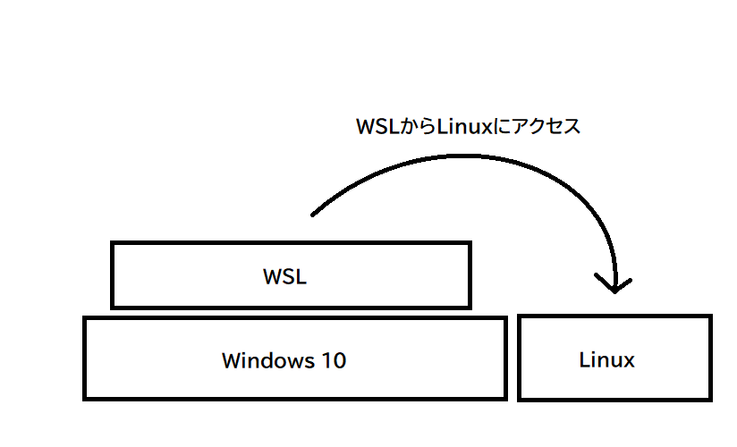
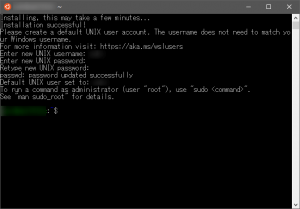
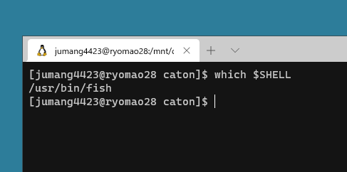

# WSLのインストール

WSLはWindowsの上でLinuxというOSのCUI機能、**bash**を動かすための**Windowsのソフトウェア**です

Windowsでは標準でコマンドプロンプト\(cmd.exe\)というCUIツールを搭載していますが、設定がめんどくさかったり、モダンなツールがそろってなかったりするので、今回はLinuxで採用されている**bashというCUIツール**をインストールします



１．仮想化技術HyperVを有効にする

  \[**コントロールパネル**\] – \[**プログラムと機能**\] – \[**Windowsの機能の有効化または無効化**\] で「**仮想マシン プラットフォーム**」と 「**Linux 用 Windows サブシステム**」へチェックを入れ、再起動する

これによって Windowsの上でLinuxが動作できるようになります

２． Ubuntu OS\( Linux \)のインストール

Linuxを使うための環境が整いましたので、実際にLinuxをダウンロードします

**Microsoft Store アプリ**を立ち上げてUbuntuと検索し、アプリをインストールする


３．実際に起動

Ubuntuというソフトが、インストールされていると思いますので、起動します

４．ユーザー名とパスワードを入れて初期設定



ユーザーネームを入力しろと催促されますので、パソコンで使う名前を入力します

英語表記が後々の設定を楽にするのでおすすめです\( 例：aiko1234, masaru4321\)

５．終わり

WSLを使ってLinuxをインストールすることができました

実際にその黒い画面に何かコマンドを打ってみましょう

```text
which $SHELL
```

とコマンドを打ってみてください、すると



/usr/bin/bashと表示されると思います（僕はfishを使っているのでfishと表示されています）

これは現在のシステムでbashというシステムを動かしているということになります

