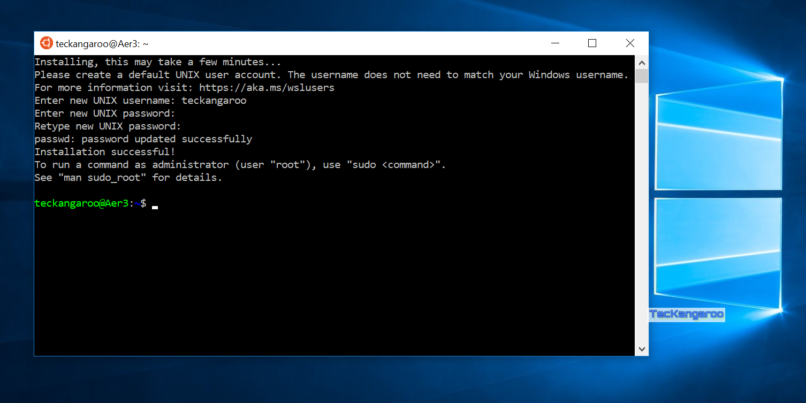
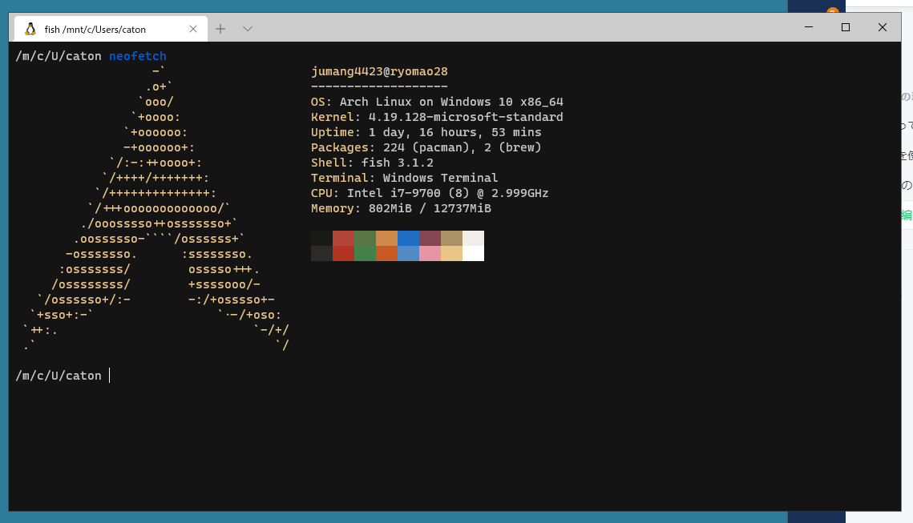
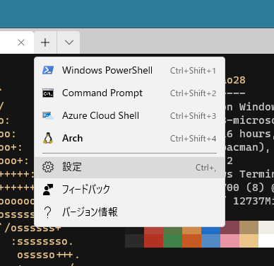

# 応用編

現在あなたのターミナルはこうなっていることでしょう



とてもシンプルで質素でいいですね

ですが、文字が小さく色がないのでとても見にくいと思います

このターミナルをカスタマイズすると



このようにきれいなフォント、大きな文字、いろんな色を表現できます

1. Windows Terminalのインストール

**Mirosoft Store**でWindows Terminalをインストールします

2. Windows Teminalを起動

実際に起動します

起動すると、Power Shellという別の種類のCUIのツールが出てきます

今回はbashを使いたいので、Windows Terminalを起動したときにbashを起動するような設定にします

3. 設定画面を開く




```text
            "guid": "{a5a97cb8-8961-5535-816d-772efe0c6a3f}",
            "hidden": false,
            "name": "Ubuntu",
            "source": "Windows.Terminal.Wsl"
        }
```

4. "name"がUbuntuのところを探してguidをコピー

ここでは

```text
{a5a97cb8-8961-5535-816d-772efe0c6a3f}
```

にあたります

１１行目ぐらいにある、

"`defaultProfile": "{a5a97cb8-8961-5535-816d-772efe0c6a3f}",`

の中身の変な文字をさっきコピーしたguidをペーストします

5. Windows Terminalを一度閉じて、再度開く

標準でUbuntu bashが立ち上がるようになります


